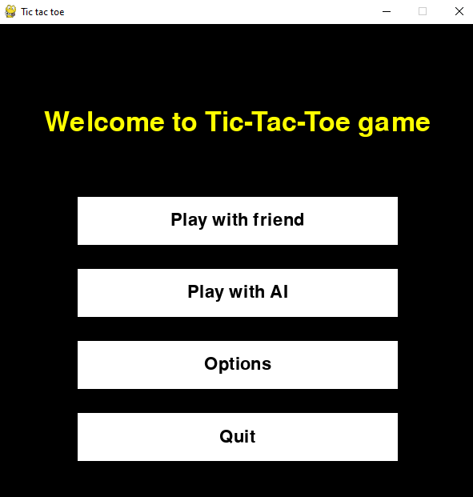

CONTENTS OF THIS FILE
---------------------

 * Introduction
 * Game modes
 * Requirements
 * Installation
 * Configuration
 * Screenshots
 
INTRODUCTION
------------

Circle and cross is a simple game written in python using pygame. 
The player can choose the board size from 3x3 to 10x10, window size and victory condition. 
The project was created to learn python and pygame. 
It was used to implement the minimax algorithm with alpha beta pruning.

GAME MODES
----------

* Player vs player  
Two players take turns choosing a square.
* Player vs AI   
Player chooses field. Then computer calculates his move based on minimax or my algorithm.

| Board size  | Used algorithm                  | Algorithm description                                                                       | Sources I used                                                                                                                                        |
|-------------|---------------------------------|---------------------------------------------------------------------------------------------|-------------------------------------------------------------------------------------------------------------------------------------------------------|
| 3x3         | Minimax with alpha beta pruning | [Minimax with alpha beta pruning](https://en.wikipedia.org/wiki/Alpha%E2%80%93beta_pruning) | [Stack Abuse]( https://stackabuse.com/minimax-and-alpha-beta-pruning-in-python/)     [Code train](https://www.youtube.com/watch?v=trKjYdBASyQ&t=1054s) |
| 4x4 - 10x10 | My algorithm                    | Plays randomly unless player or computer can win in 2 moves                                 |                                                                                                                                                       |

SCREENSHOTS
-----------

